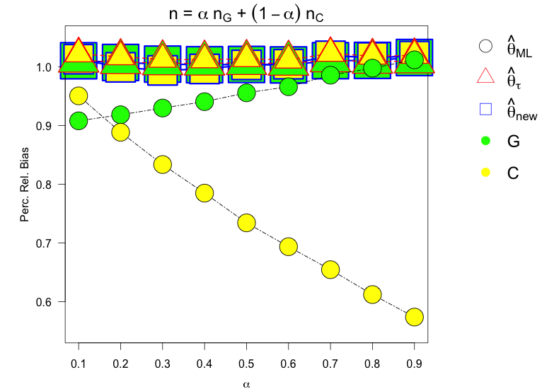

[](http://quantlet.de/index.php?p=info)

## [](http://quantlet.de/) **COPSimStuPercRelBiasMix** [](http://quantlet.de/d3/ia)

```yaml

Name of Quantlet : COPSimStuPercRelBiasMix

Published in : 'Estimation of the Dependence Parameter in Bivariate Archimedean Copula Models under
Misspecification'

Description : 'Plots the percentage relative bias of the estimates obtained for the copula
dependence parameter theta in a simulation study using ML, the inversion of Kendall''s tau, and a
p-value weighted average of the two in combination with the Gumbel and the Clayton copula. The
observations come from convex sums of Gumbel and Clayton. The estimator is indicated by line colour
and shape, the copula used in estimation is indicated by the fill colour of each shape.'

Keywords : 'Copula, Gumbel, Frank, Clayton, estimation, Kendall''s tau, maximum-likelihood,
misspecification, simulation'

See also : COPtautotheta

Author : Verena Weber

Datafile : 'ResMix0.1.txt, ResMix0.2.txt, ResMix0.3.txt, ResMix0.4.txt, ResMix0.5.txt,
ResMix0.6.txt, ResMix0.7.txt, ResMix0.8.txt, ResMix0.9.txt'

Output : 'Returns a plot of the percentage relative bias for each estimator in combination with
each copula as a function of alpha.'

```




```r
# Close windows and clear variables
rm(list = ls(all = TRUE))
graphics.off()

# If necessary, please install the following package.
# install.packages("copula")

library(copula)

# Load results from simulation study
res.mix.0.1  = read.table("ResMix0.1.txt", header = TRUE)
res.mix.0.2  = read.table("ResMix0.2.txt", header = TRUE)
res.mix.0.3  = read.table("ResMix0.3.txt", header = TRUE)
res.mix.0.4  = read.table("ResMix0.4.txt", header = TRUE)
res.mix.0.5  = read.table("ResMix0.5.txt", header = TRUE)
res.mix.0.6  = read.table("ResMix0.6.txt", header = TRUE)
res.mix.0.7  = read.table("ResMix0.7.txt", header = TRUE)
res.mix.0.8  = read.table("ResMix0.8.txt", header = TRUE)
res.mix.0.9  = read.table("ResMix0.9.txt", header = TRUE)

theta.C.0.5 = iTau(claytonCopula(), 0.5)
theta.G.0.5 = iTau(gumbelCopula(), 0.5)

alpha = seq(from = 0.1, to = 0.9, by = 0.1 )

rel.bias.plot = function(x.1, x.2, x.3, x.4, x.5, x.6, x.7, x.8, x.9, true.theta, 
                         copula, estim.method) {
  if ((estim.method == "ML") & (copula == "gumbel")) {
    Rel.Bias.ML.gumbel = c(mean(x.1$theta.G.ml/true.theta), mean(x.2$theta.G.ml/true.theta), 
                           mean(x.3$theta.G.ml/true.theta), mean(x.4$theta.G.ml/true.theta), 
                           mean(x.5$theta.G.ml/true.theta), mean(x.6$theta.G.ml/true.theta), 
                           mean(x.7$theta.G.ml/true.theta), mean(x.8$theta.G.ml/true.theta), 
                           mean(x.9$theta.G.ml/true.theta))
    return(Rel.Bias.ML.gumbel)
  } else if ((estim.method == "ML") & (copula == "clayton")) {
    Rel.Bias.ML.clayton = c(mean(x.1$theta.C.ml/true.theta), mean(x.2$theta.C.ml/true.theta), 
                            mean(x.3$theta.C.ml/true.theta), mean(x.4$theta.C.ml/true.theta), 
                            mean(x.5$theta.C.ml/true.theta), mean(x.6$theta.C.ml/true.theta), 
                            mean(x.7$theta.C.ml/true.theta), mean(x.8$theta.C.ml/true.theta), 
                            mean(x.9$theta.C.ml/true.theta))
    return(Rel.Bias.ML.clayton)
  } else if ((estim.method == "tau") & (copula == "gumbel")) {
    Rel.Bias.tau.gumbel = c(mean(x.1$theta.G.tau/true.theta), mean(x.2$theta.G.tau/true.theta), 
                            mean(x.3$theta.G.tau/true.theta), mean(x.4$theta.G.tau/true.theta), 
                            mean(x.5$theta.G.tau/true.theta), mean(x.6$theta.G.tau/true.theta), 
                            mean(x.7$theta.G.tau/true.theta), mean(x.8$theta.G.tau/true.theta), 
                            mean(x.9$theta.G.tau/true.theta))
    return(Rel.Bias.tau.gumbel)
  } else if ((estim.method == "tau") & (copula == "clayton")) {
    Rel.Bias.tau.clayton = c(mean(x.1$theta.C.tau/true.theta), mean(x.2$theta.C.tau/true.theta), 
                             mean(x.3$theta.C.tau/true.theta), mean(x.4$theta.C.tau/true.theta), 
                             mean(x.5$theta.C.tau/true.theta), mean(x.6$theta.C.tau/true.theta), 
                             mean(x.7$theta.C.tau/true.theta), mean(x.8$theta.C.tau/true.theta), 
                             mean(x.9$theta.C.tau/true.theta))
    return(Rel.Bias.tau.clayton)
  } else if ((estim.method == "new") & (copula == "gumbel")) {
    Rel.Bias.new.gumbel = c(mean(x.1$theta.G.new/true.theta), mean(x.2$theta.G.new/true.theta), 
                            mean(x.3$theta.G.new/true.theta), mean(x.4$theta.G.new/true.theta), 
                            mean(x.5$theta.G.new/true.theta), mean(x.6$theta.G.new/true.theta), 
                            mean(x.7$theta.G.new/true.theta), mean(x.8$theta.G.new/true.theta), 
                            mean(x.9$theta.G.new/true.theta))
    return(Rel.Bias.new.gumbel)
  } else if ((estim.method == "new") & (copula == "clayton")) {
    Rel.Bias.new.clayton = c(mean(x.1$theta.C.new/true.theta), mean(x.2$theta.C.new/true.theta), 
                             mean(x.3$theta.C.new/true.theta), mean(x.4$theta.C.new/true.theta), 
                             mean(x.5$theta.C.new/true.theta), mean(x.6$theta.C.new/true.theta), 
                             mean(x.7$theta.C.new/true.theta), mean(x.8$theta.C.new/true.theta), 
                             mean(x.9$theta.C.new/true.theta))
    return(Rel.Bias.new.clayton)
  }
}


reset = function() {
  par(mfrow = c(1, 1), oma = c(0, 0, 0, 0), mar = c(0, 0, 0, 0), new = TRUE)
  plot(0:1, 0:1, type = "n", xlab = " ", ylab = " ", axes = FALSE)
}

legend1 = c(expression(paste(hat(theta)["ML"])), expression(paste(hat(theta)[tau])), 
            expression(paste(hat(theta)["new"])), "G", "C")

main1 = expression(paste(n, " ", "= ", alpha, " ", n["G"], " ", "+", " ", (1 - alpha), 
                         " ", n["C"]))

par(fig = c(0, 1, 0, 1), oma = c(0, 0, 0, 0), mar = c(3.4, 4.8, 1.9, 3.4), new = TRUE)


par(xpd = T, mar = par()$mar + c(0, 0, 0, 5))
plot(alpha, rel.bias.plot(res.mix.0.1, res.mix.0.2, res.mix.0.3, res.mix.0.4, res.mix.0.5, 
                          res.mix.0.6, res.mix.0.7, res.mix.0.8, res.mix.0.9, theta.C.0.5, "gumbel", "new"), 
     type = "b", pch = 22, main = main1, lty = "solid", bg = "green", col = "blue", 
     cex = 8, ylim = c(0.55, 1.05), lwd = 3, cex.main = 1.5, las = 1, xlab = expression(alpha), 
     xaxt = "n", mgp = c(2.5, 1, 0), ylab = "Perc. Rel. Bias")
axis(1, at = alpha)

points(alpha, rel.bias.plot(res.mix.0.1, res.mix.0.2, res.mix.0.3, res.mix.0.4, res.mix.0.5, 
                            res.mix.0.6, res.mix.0.7, res.mix.0.8, res.mix.0.9, theta.C.0.5, "clayton", "new"), 
       type = "b", pch = 22, lty = "solid", col = "blue", bg = "yellow", cex = 6.5, 
       lwd = 3)

points(alpha, rel.bias.plot(res.mix.0.1, res.mix.0.2, res.mix.0.3, res.mix.0.4, res.mix.0.5, 
                            res.mix.0.6, res.mix.0.7, res.mix.0.8, res.mix.0.9, theta.C.0.5, "gumbel", "tau"), 
       type = "b", pch = 24, lty = "dashed", col = "red", bg = "green", cex = 5.9, lwd = 1.8)

points(alpha, rel.bias.plot(res.mix.0.1, res.mix.0.2, res.mix.0.3, res.mix.0.4, res.mix.0.5, 
                            res.mix.0.6, res.mix.0.7, res.mix.0.8, res.mix.0.9, theta.C.0.5, "clayton", "tau"), 
       type = "b", pch = 24, lty = "dashed", col = "red", bg = "yellow", cex = 4, lwd = 1.8)


points(alpha, rel.bias.plot(res.mix.0.1, res.mix.0.2, res.mix.0.3, res.mix.0.4, res.mix.0.5, 
                            res.mix.0.6, res.mix.0.7, res.mix.0.8, res.mix.0.9, theta.C.0.5, "gumbel", "ML"), 
       type = "b", pch = 21, lty = "twodash", bg = "green", cex = 3.5, lwd = 1.2)

points(alpha, rel.bias.plot(res.mix.0.1, res.mix.0.2, res.mix.0.3, res.mix.0.4, res.mix.0.5, 
                            res.mix.0.6, res.mix.0.7, res.mix.0.8, res.mix.0.9, theta.C.0.5, "clayton", "ML"), 
       type = "b", pch = 21, lty = "twodash", bg = "yellow", cex = 3.5, lwd = 1.2)


reset()
legend(0.885, 1, legend1, col = c("black", "red", "blue", "green", "yellow"), 
       pch = c(21, 24, 22, 20, 20, 20), bty = "n", cex = 1.5, pt.cex = 2.5)


```
