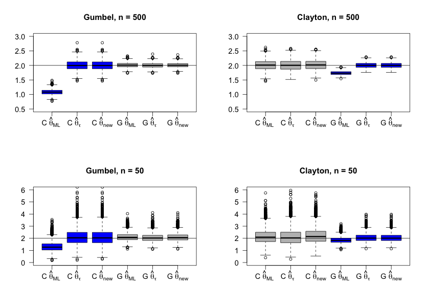

[](http://quantlet.de/index.php?p=info)

## [](http://quantlet.de/) **CopSimStudyBoxpl** [](http://quantlet.de/d3/ia)

```yaml

Name of Quantlet : CopSimStudyBoxpl

Published in : 'Estimation of the Dependence Parameter in Bivariate Archimedean Copula Models under
Misspecification'

Description : 'Returns boxplots of the estimates obtained for the copula dependence parameter in a
simulation study using ML, the inversion of Kendall's tau and a p-value weighted average of the two
estimates in combination with the Gumbel and the Clayton copula. True copula and size of simulated
random sample are indicated by the title of each plot. Distribution of estimates obtained using a
misspecified copula are illustrated by blue boxplots, those obtained with the the true copula are
depicted by grey boxplots.'

Keywords : 'Copula, Gumbel, Frank, Clayton, estimation, misspecification, Kendall's tau,
maximum-likelihood, simulation'

See also : COPtautotheta

Author : Verena Weber

Datafile : 'ResClaytonLarge0.5.txt, ResClaytonSmall0.5.txt, ResGumbelLarge0.5.txt,
ResGumbelSmall0.5.txt'

Output : Returns boxplots of the distributions of obtained estimates.

```




```r
# Close windows and clear variables
rm(list = ls(all = TRUE))
graphics.off()

# please install these package if necessary
# install.packages("copula")
library(copula)

# Load results from simulation study
res.gumbel.0.5.l  = read.table("ResGumbelLarge0.5.txt", header = TRUE)
res.gumbel.0.5.s  = read.table("ResGumbelSmall0.5.txt", header = TRUE)
res.clayton.0.5.l = read.table("ResClaytonLarge0.5.txt", header = TRUE)
res.clayton.0.5.s = read.table("ResClaytonSmall0.5.txt", header = TRUE)

# Calculate true thetas from Kendall's tau
theta.C.0.5 = iTau(claytonCopula(), 0.5)
theta.G.0.5 = iTau(gumbelCopula(), 0.5)

# do plot
par(mfrow=c(2,2))
par(cex.axis=1.1)

labels.y = c(expression(paste("C ", hat(theta)["ML"], " ")), 
             expression(paste("C ", hat(theta)[tau], "   ")), 
             expression(paste("C ", hat(theta)["new"])), 
             expression(paste("G ", hat(theta)["ML"], " ")), 
             expression(paste("G ", hat(theta)[tau], "   ")), 
             expression(paste("G ", hat(theta)["new"])))

boxplot(res.gumbel.0.5.l$theta.clay.ML, res.gumbel.0.5.l$theta.clay.tau, res.gumbel.0.5.l$theta.new.clayton, 
        res.gumbel.0.5.l$theta.gum.ML,  res.gumbel.0.5.l$theta.gum.tau,  res.gumbel.0.5.l$theta.new.gumbel, 
        names = labels.y, mgp = c(3, 2, 0), col = c("blue", "blue", "blue", "grey", "grey", "grey"), 
        las = 1, ylim = c(0.5, 3), main = "Gumbel, n = 500")
abline(h = theta.G.0.5)

par(cex.axis = 1.1)
boxplot(res.clayton.0.5.l$theta.clay.ML, res.clayton.0.5.l$theta.clay.tau, res.clayton.0.5.l$theta.new.clayton, 
        res.clayton.0.5.l$theta.gum.ML,  res.clayton.0.5.l$theta.gum.tau,  res.clayton.0.5.l$theta.new.gumbel, 
        ylim = c(0.5, 3), names = labels.y, col = c("grey", "grey", "grey", "blue", "blue", "blue"), 
        las = 1, mgp = c(3, 2, 0), main = "Clayton, n = 500")
abline(h = theta.C.0.5)

par(cex.axis = 1.1)
boxplot(res.gumbel.0.5.s$theta.clay.ML, res.gumbel.0.5.s$theta.clay.tau, res.gumbel.0.5.s$theta.new.clayton, 
        res.gumbel.0.5.s$theta.gum.ML,  res.gumbel.0.5.s$theta.gum.tau,  res.gumbel.0.5.s$theta.new.gumbel, 
        ylim = c(0, 6), names = labels.y, col = c("blue", "blue", "blue", "grey", "grey", "grey"), 
        las = 1, mgp = c(3, 2, 0), main = "Gumbel, n = 50")
abline(h = theta.G.0.5)


par(cex.axis = 1.1)
boxplot(res.clayton.0.5.s$theta.clay.ML, res.clayton.0.5.s$theta.clay.tau, res.clayton.0.5.s$theta.new.clayton, 
        res.clayton.0.5.s$theta.gum.ML,  res.clayton.0.5.s$theta.gum.tau,  res.clayton.0.5.s$theta.new.gumbel, 
        ylim = c(0, 6), names = labels.y, col = c("grey", "grey", "grey", "blue", "blue", "blue"), 
        las = 1, mgp = c(3, 2, 0), main = "Clayton, n = 50")
abline(h = theta.C.0.5) 
```
