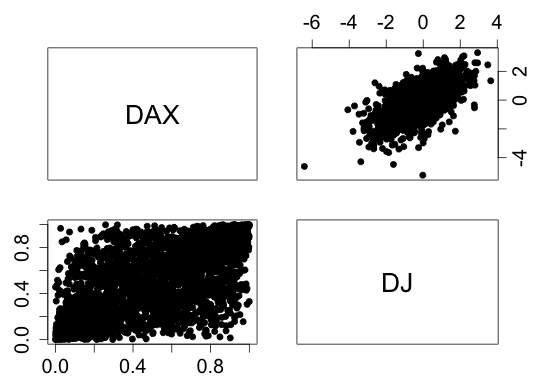

[](http://quantlet.de/index.php?p=info)

## [](http://quantlet.de/) **COPapp2residual** [](http://quantlet.de/d3/ia)

```yaml

Name of Quantlet : COPapp2residual

Published in : 'Estimation of the Dependence Parameter in Bivariate Archimedean Copula Models under
Misspecification'

Description : 'COPapp2residual shows pairwise scatter plots of based on AR(1)-GJR-GARCH(1,1) /
AR(1)-GJR-GARCH(2,1) fitted residuals. The upper triangular plots show the pairwise residuals
scatter points. The lower triangular plots show the scatter points computed from empirical cdf of
the residuals. The companies Volkswagen (VW) and Thyssen-Krupp (TK) as well as the stock indices
DAX and DJIA are contained.'

Keywords : correlation, ARMA, GARCH, edf, plot

See also : COPapp1prices, COPapp1return, COPapp1residual

Author : Ostap Okhrin, Yafei Xu

Author[New] : Verena Weber

Datafile : DataDAXDJTKVW.txt

Output : 'COPapp2residual returns pairwise scatter plots from AR-GJR-GARCH residuals (upper
triangular) and from residuals mapped on unit square by the empirical cdf (lower triangular),
including DAX, DJ, VW, and TK.'

```




```r
graphics.off()
rm(list = ls(all = TRUE))

# please install these packages if necessary
# install.packages("fGarch")
# install.packages("QRM")
# install.packages("copula")

library(fGarch)
library(QRM)
library(copula)

S = read.table("DataDAXDJTKVW.txt", skip = 6, header = T, sep=";")[ ,c(2:5)] 
date.time = read.table("DataDAXDJTKVW.txt", sep=";",  skip=7)[ ,1] 

X = S[-1,]
for(i in 1:length(S[1,]))X[,i] = log(S[-1,i]/S[-length(S[,i]),i]) #compute log returns


feps    = matrix(nrow = dim(X)[1], ncol = dim(X)[2])
eps     = matrix(nrow = dim(X)[1], ncol = dim(X)[2])
eps.squ = matrix(nrow = dim(X)[1], ncol = dim(X)[2])
sigma.t = matrix(nrow = dim(X)[1], ncol = dim(X)[2])

###############################
#### AR(1)-GJR-GARCH(2,1) Fit

#select the indices
sel.pairs = c(1,2) 

params.ind  = matrix(nrow = 2 * dim(X[, sel.pairs])[2], ncol = 14)

for(i in sel.pairs) {
  fit                       = garchFit(~arma(1,0) + aparch(2, 1), 
                              delta = 2, include.delta = FALSE, data = X[, i], 
                              cond.dist = "sged", trace = F)
  eps[, i]                  = fit@residuals
  sigma.t[, i]              = fit@sigma.t
  eps[, i]                  = eps[, i] / sigma.t[, i]   # standardize residuals   
  eps.squ[, i]              = eps[, i]^2 
  params.ind[(2 * i - 1), ] = c(fit@fit$coef, 
                                Box.test(eps[, i], type = "Ljung-Box", lag = 12)$p.value, 
                                Box.test(eps.squ[, i], type = "Ljung-Box", lag = 12)$p.value, 
                                ks.test(eps[, i], "pnorm")$p.value, 
                                ks.test(eps[, i], "psged")$p.value)
  params.ind[(2 * i), ]     = c(fit@fit$matcoef[, 2], NA, NA, NA, NA)
  feps[, i]                 = edf(eps[, i], adjust = TRUE)
}

colnames(params.ind) = c("mu", "ar1", "omega", "alpha1", "alpha2", "gamma1", "gamma2", 
                         "beta1", "skew", "shape", "BL.eps", "BL.eps.squ", "KS.norm", "KS.sged")
rownames(params.ind) = rep(colnames(X[, sel.pairs]), each = 2)

###############################
#### AR(1)-GJR-GARCH(1,1) Fit

#select the stocks
sel.pairs = c(3,4) 

params.sto  = matrix(nrow = 2 * dim(X[, sel.pairs])[2], ncol = 12)

for(i in sel.pairs) {
  fit                       = garchFit(~arma(1,0) + aparch(1, 1), delta = 2, 
                              include.delta = FALSE, data = X[, i], 
                              cond.dist = "sged", trace = F)
  eps[, i]                  = fit@residuals
  sigma.t[, i]              = fit@sigma.t
  eps[, i]                  = eps[, i] / sigma.t[, i]   # standardize residuals   
  eps.squ[, i]              = eps[, i]^2 
  params.sto[(2 * i - 5), ] = c(fit@fit$coef, 
                                Box.test(eps[, i], type = "Ljung-Box", lag = 12)$p.value, 
                                Box.test(eps.squ[, i], type = "Ljung-Box", lag = 12)$p.value, 
                                ks.test(eps[, i], "pnorm")$p.value, 
                                ks.test(eps[, i], "psged")$p.value)
  params.sto[(2 * i - 4), ] = c(fit@fit$matcoef[, 2], NA, NA, NA, NA)
  feps[, i]                 = edf(eps[, i], adjust = TRUE)
}

colnames(params.sto) = c("mu", "ar1", "omega", "alpha1", "gamma1", "beta1", "skew",
                         "shape", "BL.eps", "BL.eps.squ", "KS.norm", "KS.sged")
rownames(params.sto) = rep(colnames(X[, sel.pairs]), each = 2)

#########
# do plot
layout(matrix(1:4, nrow=2, ncol=2, byrow = T))

par(mar=c(1, 3, 3, 1))
plot(0, 0, axes = FALSE, frame = TRUE, col = "white", xlab = "", ylab = "")
text(0, 0, "DAX", cex = 2)

par(mar=c(1, 1.5, 3, 3), pty="m")
plot(eps[, 2], eps[, 1], pch = 19, xlab = "", ylab = "", axes = F,
     frame = T); axis(3, cex.axis=1.5); axis(4, cex.axis=1.5)


par(mar=c(3, 3, 1.5, 1), pty="m")
plot(edf(eps[, 1], F), edf(eps[, 2], F), pch = 19, xlab = "",
     ylab = "", axes = F, frame = T); axis(2, cex.axis=1.5); axis(1, cex.axis=1.5)

par(mar=c(3, 1.5, 1.5, 3), pty="m")
plot(0, 0, axes = FALSE, frame = TRUE, col = "white", xlab = "",
     ylab = "")
text(0, 0, "DJ", cex = 2)

########
layout(matrix(1:4, nrow=2, ncol=2, byrow = T))

par(mar=c(1, 3, 3, 1))
plot(0, 0, axes = FALSE, frame = TRUE, col = "white", xlab = "", ylab = "")
text(0, 0, "VW", cex = 2)

par(mar=c(1, 1.5, 3, 3), pty="m")
plot(eps[, 4], eps[, 3], pch = 19, xlab = "", ylab = "", axes = F,
     frame = T); axis(3, cex.axis=1.5); axis(4, cex.axis=1.5)


par(mar=c(3, 3, 1.5, 1), pty="m")
plot(edf(eps[, 3], F), edf(eps[, 4], F), pch = 19, xlab = "",
     ylab = "", axes = F, frame = T); axis(1, cex.axis=1.5); axis(2, cex.axis=1.5)

par(mar=c(3, 1.5, 1.5, 3), pty="m")
plot(0, 0, axes = FALSE, frame = TRUE, col = "white", xlab = "",
     ylab = "")
text(0, 0, "TK", cex = 2)


```
