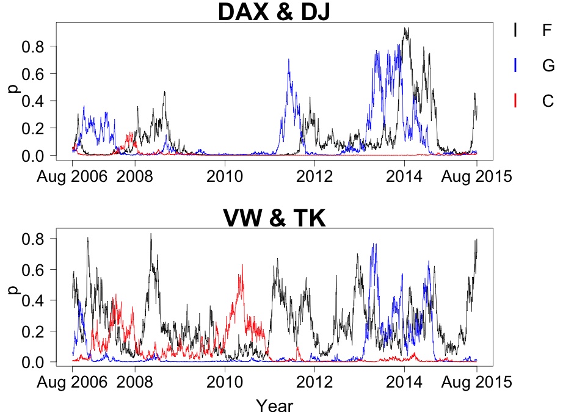

[](http://quantlet.de/)

## [](http://quantlet.de/) **COPp.values** [](http://quantlet.de/)

```yaml

Name of Quantlet : COPp.values

Published in : 'Estimation of the Dependence Parameter in Bivariate Archimedean Copula Models under
Misspecification'

Description : 'Plots the p-values obtained from a rank-based Goodness-of-Fit test applied to moving
windows of size 250 testing Frank, Gumbel, and Clayton to be the adequate copula to model the
dependence between series of AR-GJR-GARCH residuals from returns of DAX and DJ as well as from
returns of Volkswagen and Thyssen-Krupp. The dependence parameter of the tested model was estimated
using Maximum Likelihood. The considered time span is 26.08.2005 to 13.08.2015.'

Keywords : Copula, Gumbel, Frank, Clayton, GoF test

See also : COPretaparch, CopDynEst, COPapp2residual

Author : Verena Weber

Datafile : P.ValuesIndices.txt, P.ValuesStocks.txt

Output : 'Returns a plot of the 3 time series for each of the two portfolios (DAX and DJ, VW and
TK).'

```




### R Code:
```r
# Close windows and clear variables
rm(list = ls(all = TRUE))
graphics.off()

#Load results from estimation
p.values.ind = read.table("P.ValuesIndices.txt", header = TRUE)[ ,c(2:4)] 
p.values.sto = read.table("P.ValuesStocks.txt",  header = TRUE)[ ,c(2:4)] 
dates        = read.table("P.ValuesStocks.txt",  header = TRUE)[ ,1] 
dates        = as.Date(as.vector(dates))

# Plot

reset = function() {
  par(mfrow = c(1, 1), oma = c(0, 0, 0, 0), mar = c(0, 0, 0, 0), new = TRUE)
  plot(0:1, 0:1, type = "n", xlab = " ", ylab = " ", axes = FALSE)
}

par(fig = c(0, 1, 0, 1), oma = c(0, 0, 0, 0), mar = c(3.9, 4.8, 1.9, 1.9), new = TRUE)

par(mfrow = c(2, 1))

par(xpd = T, mar = par()$mar + c(0, 0, 0, 5))
plot(dates, p.values.ind[, "p.F"], type = "l", xlab = NA, mgp = c(3.1, 1, 0), las = 1, 
     ylab = " p", main = "DAX & DJ", cex.main = 2.5, cex.lab = 1.8, cex.axis = 1.7)
points(dates, p.values.ind[, "p.G"], type = "l", col = "blue")
points(dates, p.values.ind[, "p.C"], type = "l", col = "red")
axis(1, dates[c(1, 2350)], format(dates[c(1, 2350)], "%b %Y"), cex.axis = 1.7, tick = T)


plot(dates, p.values.sto[, "p.F"], type = "l", xlab = "Year", mgp = c(3.1, 1, 0), las = 1, 
     ylab = "   p", main = "VW & TK", cex.main = 2.5, cex.lab = 1.8, cex.axis = 1.7)
points(dates, p.values.sto[, "p.G"], type = "l", col = "blue")
points(dates, p.values.sto[, "p.C"], type = "l", col = "red")
axis(1, dates[c(1, 2350)], format(dates[c(1, 2350)], "%b %Y"), cex.axis = 1.7, tick = T)

reset()
legend(0.88, 1.055, c("F", "G", "C"), col = c("black", "blue", "red"), bty = "n", 
       pch = "l", cex = 1.75, pt.cex = 2) 
```
