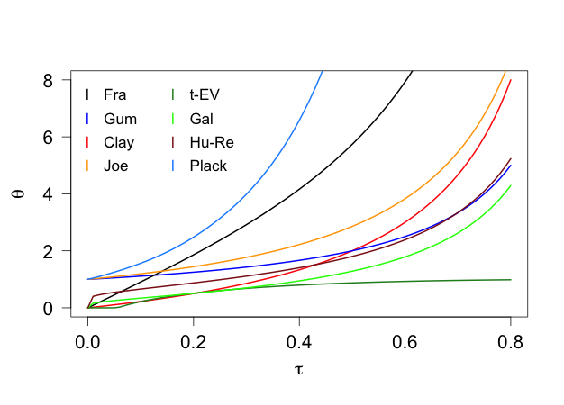

[](http://quantlet.de/index.php?p=info)

## [](http://quantlet.de/) **COPtautotheta** [](http://quantlet.de/d3/ia)

```yaml

Name of Quantlet : COPtautotheta

Published in : 'Estimation of the Dependence Parameter in Bivariate Archimedean Copula Models under
Misspecification'

Description : 'Plots the dependence parameter theta as a function of Kendall''s tau for the Frank,
the Gumbel, the Clayton, the Joe, the t-EV, the Galambos, the Husler-Reiss, and the Plackett
copula.'

Keywords : Copula, Gumbel, Frank, Clayton, Kendall''s tau

Author : Verena Weber

Output : Returns a plot of the tau(theta)-functions for various copulas over the interval [0, 0.8].

```




```r
# Close windows and clear variables
rm(list = ls(all = TRUE))
graphics.off()

# please install these package if necessary
# install.packages("copula")

library(copula)

tau     = seq(from = 0, to = 0.8, by = 0.01)

par(mgp = c(2.5, 1, 0))

plot(tau, iTau(claytonCopula(), tau), col = "red", type = "l", xlab = expression(tau), 
     ylab = expression(theta), lwd = 2, cex.lab = 1.3, cex.axis = 1.3, las = 1)
points(tau, iTau(gumbelCopula(), tau), type = "l",col = "blue", lwd = 2)
points(tau, iTau(frankCopula(), tau), type = "l", lwd = 2)
points(tau, iTau(joeCopula(), tau), type = "l", col = "orange", lwd = 2)
points(tau, iTau(tevCopula(), tau), type = "l", col = "forestgreen", lwd = 2)
points(tau, iTau(galambosCopula(), tau), type = "l", col = "green", lwd = 2)
points(tau, iTau(huslerReissCopula(), tau), type = "l", col = "firebrick4", lwd = 2)
points(tau, iTau(plackettCopula(), tau), type = "l", col = "dodgerblue1", lwd = 2)

legend2 = c("Fra", "Gum", "Clay", "Joe", "t-EV", "Gal", "Hu-Re", "Plack")

legend("topleft", legend2, 
       col = c("black", "blue", "red", "orange", "forestgreen", "green", "firebrick4", "dodgerblue1"), 
       pch = "l", bty = "n", ncol = 2, cex = 1.07) 

```
