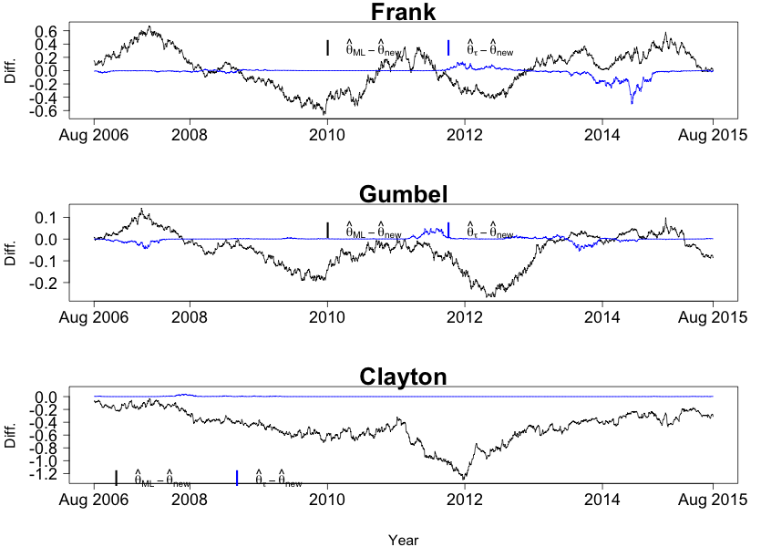
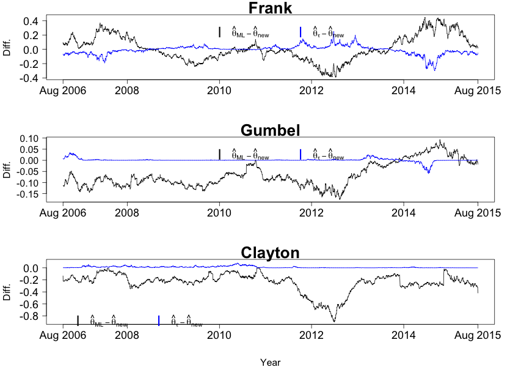

[](http://quantlet.de/index.php?p=info)

## [](http://quantlet.de/) **COPthetasDiff** [](http://quantlet.de/d3/ia)

```yaml

Name of Quantlet : COPthetasDiff

Published in : 'Estimation of the Dependence Parameter in Bivariate Archimedean Copula Models under
Misspecification'

Description : 'Plots the difference between the dynamically estimated estimated for dependence
parameter theta using maximum likelihood, the inversion of Kendall's tau and a p-value weighted
average of the two in combination with the Frank, the Gumbel, and the Clayton copula for a series
of AR-GJR-GARCH residuals from returns of DAX and DJ as well as from returns of Volkswagen and
Thyssen-Krupp. The considered time span is 26.08.2005 to 13.08.2015. The moving window is 250.'

Keywords : Copula, Gumbel, Frank, Clayton, estimation, maximum-likelihood, Kendall's tau

See also : CopDynEst, COPretaparch

Author : Verena Weber

Datafile : ThetasIndices.txt, ThetasStocks.txt

Output : 'Returns two plots (as pdf files) of the 6 time series for each of the two portfolios (DAX
and DJ, VW and TK) and a table of of summary statistics of the calculated differences.'

```






```r
# Close windows and clear variables
rm(list = ls(all = TRUE))
graphics.off()

#Load results from estimation
thetas.ind = read.table("ThetasIndices.txt", header = TRUE)[, c(2:10)] 
thetas.sto = read.table("ThetasStocks.txt",  header = TRUE)[, c(2:10)] 
dates      = read.table("ThetasStocks.txt",  header = TRUE)[, 1] 
dates      = as.Date(as.vector(dates))

############
#### Indices

#Calculate differences

diff.thetas.ML.Frank.ind    = thetas.ind[, "theta.F.ML"]  - thetas.ind[, "theta.F.new"]
diff.thetas.tau.Frank.ind   = thetas.ind[, "theta.F.tau"] - thetas.ind[, "theta.F.new"]

diff.thetas.ML.Gumbel.ind   = thetas.ind[, "theta.G.ML"]  - thetas.ind[, "theta.G.new"]
diff.thetas.tau.Gumbel.ind  = thetas.ind[, "theta.G.tau"] - thetas.ind[, "theta.G.new"]

diff.thetas.ML.Clayton.ind  = thetas.ind[, "theta.C.ML"]  - thetas.ind[, "theta.C.new"]
diff.thetas.tau.Clayton.ind = thetas.ind[, "theta.C.tau"] - thetas.ind[, "theta.C.new"]

# Plot

pdf(paste("Differences thetas - Indices", ".pdf", sep = ""), width = 9, height = 11)

par(fig = c(0, 1, 0, 1), oma = c(0, 0, 0, 0), mar = c(5.5, 6, 1.9, 2), new = TRUE)

par(mfrow=c(3,1))

plot(dates, diff.thetas.ML.Frank.ind, type = "l", xlab = NA, main = "Frank", las = 1, 
     ylab = "Diff.", cex.axis = 1.7, cex.lab = 1.5, cex.main = 2.5, mgp = c(4.5, 1, 0))
axis(1, dates[c(1, 2350)], format(dates[c(1, 2350)], "%b %Y"), tick = T, cex.axis = 1.7)
points(dates, diff.thetas.tau.Frank.ind, type = "l", col = "blue")


plot(dates, diff.thetas.ML.Gumbel.ind, type = "l", xlab = NA, main = "Gumbel", las = 1, 
     ylab = "Diff.", cex.axis = 1.7, cex.lab = 1.5, cex.main = 2.5, mgp = c(4.5, 1, 0))
axis(1, dates[c(1, 2350)], format(dates[c(1, 2350)], "%b %Y"), tick = T, cex.axis = 1.7)
points(dates, diff.thetas.tau.Gumbel.ind, type = "l", col = "blue")

plot(dates, diff.thetas.ML.Clayton.ind, type = "l", xlab = "Year", 
     ylim = c(-1.3, 0.1), main = "Clayton", las = 1, ylab = "Diff.", 
     cex.axis = 1.7, cex.lab = 1.5, cex.main = 2.5, mgp = c(4.5, 1, 0))
axis(1, dates[c(1, 2350)], format(dates[c(1, 2350)], "%b %Y"), tick = T, cex.axis = 1.7)
points(dates, diff.thetas.tau.Clayton.ind, type = "l", col = "blue")

reset = function() {
  par(mfrow = c(1, 1), oma = c(0, 0, 0, 0), mar = c(0, 0, 0, 0), new = TRUE)
  plot(0:1, 0:1, type = "n", xlab = " ", ylab = " ", axes = FALSE)
}

legend2 = c(expression(paste(hat(theta)["ML"] - hat(theta)["new"])), 
            expression(paste(hat(theta)[tau]  - hat(theta)["new"])))

reset()
legend(0.4, 1, legend2,    col = c("black", "blue"), pch = "l", 
       horiz = T, pt.cex = 1.5, bty = "n", cex = 0.9)
legend(0.4, 0.64, legend2, col = c("black", "blue"), pch = "l", 
       horiz = T, pt.cex = 1.5, bty = "n", cex = 0.9)
legend(0.1, 0.15, legend2, col = c("black", "blue"), pch = "l", 
       horiz = T, pt.cex = 1.5, bty = "n", cex = 0.9)
dev.off()

#Stocks

# Calculate differences

diff.thetas.ML.Frank.sto = thetas.sto[, "theta.F.ML"]     - thetas.sto[, "theta.F.new"]
diff.thetas.tau.Frank.sto = thetas.sto[, "theta.F.tau"]   - thetas.sto[, "theta.F.new"]

diff.thetas.ML.Gumbel.sto = thetas.sto[, "theta.G.ML"]    - thetas.sto[, "theta.G.new"]
diff.thetas.tau.Gumbel.sto = thetas.sto[, "theta.G.tau"]  - thetas.sto[, "theta.G.new"]

diff.thetas.ML.Clayton.sto = thetas.sto[, "theta.C.ML"]   - thetas.sto[, "theta.C.new"]
diff.thetas.tau.Clayton.sto = thetas.sto[, "theta.C.tau"] - thetas.sto[, "theta.C.new"]

# do plot

pdf(paste("Differences thetas - Stocks", ".pdf", sep = ""), width = 9, height = 11)

par(fig = c(0, 1, 0, 1), oma = c(0, 0, 0, 0), mar = c(5.5, 6, 1.9, 2), new = TRUE)

par(mfrow=c(3,1))

plot(dates, diff.thetas.ML.Frank.sto, type = "l", xlab = NA, main = "Frank", las = 1, 
     ylab = "Diff.", cex.axis = 1.7, cex.lab = 1.5, cex.main = 2.5, mgp = c(4.5, 1, 0))
axis(1, dates[c(1, 2350)], format(dates[c(1, 2350)], "%b %Y"), tick = T, cex.axis = 1.7)
points(dates, diff.thetas.tau.Frank.sto, type = "l", col = "blue")


plot(dates, diff.thetas.ML.Gumbel.sto, type = "l", xlab = NA, main = "Gumbel", las = 1, 
     ylab = "Diff.", cex.axis = 1.7, cex.lab = 1.5, cex.main = 2.5, 
     mgp = c(4.5, 1, 0), yaxt = "n")
axis(2, c(-0.15, -0.1, -0.05, 0, 0.05, 0.1), tick = T, cex.axis = 1.5, las = 1)
axis(1, dates[c(1, 2350)], format(dates[c(1, 2350)], "%b %Y"), tick = T, cex.axis = 1.7)
points(dates, diff.thetas.tau.Gumbel.sto, type = "l", col = "blue")


plot(dates, diff.thetas.ML.Clayton.sto, type = "l", xlab = "Year", ylim = c(-0.9, 0.1), 
     main = "Clayton", las = 1, ylab = "Diff.", cex.axis = 1.7, cex.lab = 1.5, 
     cex.main = 2.5, mgp = c(4.5, 1, 0))
axis(1, dates[c(1, 2350)], format(dates[c(1, 2350)], "%b %Y"), tick = T, cex.axis = 1.7)
points(dates, diff.thetas.tau.Clayton.sto, type = "l", col = "blue")


reset()
legend(0.4, 1, legend2,    col = c("black", "blue"), pch = "l", horiz = T, 
       pt.cex = 1.5, bty = "n", cex = 0.9)
legend(0.4, 0.64, legend2, col = c("black", "blue"), pch = "l", horiz = T, 
       pt.cex = 1.5, bty = "n", cex = 0.9)
legend(0.1, 0.15, legend2, col = c("black", "blue"), pch = "l", horiz = T, 
       pt.cex = 1.5, bty = "n", cex = 0.9)

dev.off()

# Table of summary statistics of the above calculated differences 

mean.sd = function(x) {
  mean  = mean(x)
  sd    = sd(x)
  res   = rbind(mean, sd)
  return (res)
}

table.mean.sd.thetas =  rbind(cbind(mean.sd(diff.thetas.ML.Frank.ind),   
                                    mean.sd(diff.thetas.tau.Frank.ind),
                                    mean.sd(diff.thetas.ML.Gumbel.ind),  
                                    mean.sd(diff.thetas.tau.Gumbel.ind),
                                    mean.sd(diff.thetas.ML.Clayton.ind), 
                                    mean.sd(diff.thetas.tau.Clayton.ind)),
                              cbind(mean.sd(diff.thetas.ML.Frank.sto),   
                                    mean.sd(diff.thetas.tau.Frank.sto),
                                    mean.sd(diff.thetas.ML.Gumbel.sto),  
                                    mean.sd(diff.thetas.tau.Gumbel.sto),
                                    mean.sd(diff.thetas.ML.Clayton.sto), 
                                    mean.sd(diff.thetas.tau.Clayton.sto)))
colnames(table.mean.sd.thetas) = c("Frank.ML", "Frank.tau", "Gumbel.ML", 
                                   "Gumbel.tau", "Clayton.ML", "Clayton.tau")


```
