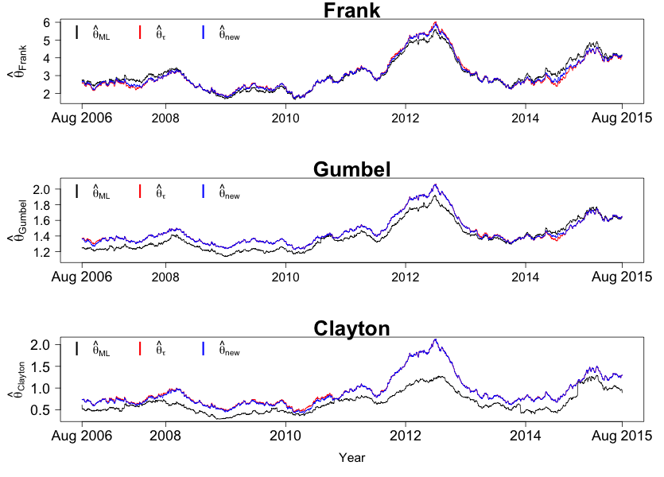

[](http://quantlet.de/index.php?p=info)

## [](http://quantlet.de/) **CopDynEst** [](http://quantlet.de/d3/ia)


```yaml

Name of Quantlet: CopDynEst

Published in: Estimation of the Dependence Parameter in Bivariate Archimedean
              Copula Models under Misspecification

Description: Plots the dynamically estimated dependence parameter theta 
             over time. The dependence between series of AR-GJR-GARCH 
             residuals from returns of DAX and DJ as well as from returns of
             Volkswagen and Thyssen-Krupp was estimated using the Frank, the
             Gumbel and the Clayton copula in combination with maximum like-
             likelihood, the inversion of Kendall's tau and a p-value weighted
             average of the two. The considered time span is 26.08.2005 
             to 13.08.2015. The moving window is 250.

Keywords: Copula, Gumbel, Frank, Clayton, estimation, dependence parameter

See also: COPretaparch, COPthetasDiff

Author: Verena Weber

Submitted:  

Datafile: ThetasIndices.txt, ThetasStocks.txt

Input: ThetasIndices.txt, ThetasStocks.txt

Output:  Returns two plots (as pdf files) of the 9 time series for each 
         of the two portfolios (DAX and  DJ, VW and TK).


```





```R
# Close windows and clear variables
rm(list = ls(all = TRUE))
graphics.off()

#Load results from estimation
thetas.ind = read.table("ThetasIndices.txt", header = TRUE)[, c(2:10)] 
thetas.sto = read.table("ThetasStocks.txt",  header = TRUE)[, c(2:10)] 
dates      = read.table("ThetasStocks.txt",  header = TRUE)[, 1] 
dates      = as.Date(as.vector(dates))

############
#### Indices

pdf(paste("Thetas over time - Indices", ".pdf", sep = ""), width = 9, height = 11)
par(fig = c(0, 1, 0, 1), oma = c(0, 0, 0, 0), mar = c(5.5, 6, 1.9, 2), new = TRUE)

par(mfrow = c(3, 1))

# Plot estimates of theta obtained using the Frank copula and each of the three
# estimators

plot(dates, thetas.ind[, "theta.F.ML"], type = "l", ylab = expression(paste(hat(theta)["Frank"])), 
     mgp = c(3.2, 1, 0), las = 1, ylim = c(3, 7), main = "Frank", cex.axis = 1.7, 
     cex.lab = 1.5, xlab = NA, cex.main = 2.5)
points(dates, thetas.ind[, "theta.F.tau"], type = "l", col = "red")
points(dates, thetas.ind[, "theta.F.new"], type = "l", col = "blue")
axis(1, dates[c(1, 2350)], format(dates[c(1, 2350)], "%b %Y"), tick = T, cex.axis = 1.7)

# Plot estimates of theta obtained using the Gumbel copula and each of the three
# estimators

plot(dates, thetas.ind[, "theta.G.ML"], type = "l", ylab = expression(paste(hat(theta)["Gumbel"])), 
     mgp = c(3.2, 1, 0), las = 1, ylim = c(1.4, 2.3), main = "Gumbel", cex.axis = 1.7, 
     cex.lab = 1.5, xlab = NA, cex.main = 2.5)
points(dates, thetas.ind[, "theta.G.tau"], type = "l", col = " red")
points(dates, thetas.ind[, "theta.G.new"], type = "l", col = "blue")
axis(1, dates[c(1, 2350)], format(dates[c(1, 2350)], "%b %Y"), tick = T, cex.axis = 1.7)

# Plot estimates of theta obtained using the Clayton copula and each of the three
# estimators

plot(dates, thetas.ind[, "theta.C.ML"], type = "l", ylab = expression(paste(hat(theta)["Clayton"])), 
     xlab = "Year", mgp = c(3.2, 1, 0), las = 1, ylim = c(0.6, 2.5), main = "Clayton", 
     cex.axis = 1.7, cex.lab = 1.5, cex.main = 2.5)
points(dates, thetas.ind[, "theta.C.tau"], type = "l", col = "red")
points(dates, thetas.ind[, "theta.C.new"], type = "l", col = "blue")
axis(1, dates[c(1, 2350)], format(dates[c(1, 2350)], "%b %Y"), tick = T, cex.axis = 1.7)

# Add legends to the plots

legend1 = c(expression(paste(hat(theta)["ML"])), expression(paste(hat(theta)[tau])), 
            expression(paste(hat(theta)["new"])))

reset = function() {
  par(mfrow = c(1, 1), oma = c(0, 0, 0, 0), mar = c(0, 0, 0, 0), new = TRUE)
  plot(0:1, 0:1, type = "n", xlab = " ", ylab = " ", axes = FALSE)
}

reset()
legend(0.06, 0.96, legend1, col = c("black", "red", "blue"), pch = "l", horiz = T, 
       pt.cex = 1.5, bty = "n", cex = 0.9)
legend(0.06, 0.6, legend1, col = c("black", "red", "blue"), pch = "l", horiz = T, 
       pt.cex = 1.5, bty = "n", cex = 0.9)
legend(0.06, 0.245, legend1, col = c("black", "red", "blue"), pch = "l", horiz = T, 
       pt.cex = 1.5, bty = "n", cex = 0.9)

dev.off()

#################
########## Stocks


pdf(paste("Thetas over time - Stocks", ".pdf", sep = ""), width = 9, height = 11)

par(fig = c(0, 1, 0, 1), oma = c(0, 0, 0, 0), mar = c(5.5, 6, 1.9, 2), new = TRUE)

par(mfrow = c(3, 1))

plot(dates, thetas.sto[, "theta.F.ML"], type = "l", ylab = expression(paste(hat(theta)["Frank"])), 
     mgp = c(3.2, 1, 0), las = 1, main = "Frank", ylim = c(1.6, 6), cex.axis = 1.5, 
     cex.lab = 1.7, xlab = NA, cex.main = 2.5, new = T)
points(dates, thetas.sto[, "theta.F.tau"], type = "l", col = "red")
points(dates, thetas.sto[, "theta.F.new"], type = "l", col = "blue")
axis(1, dates[c(1, 2350)], format(dates[c(1, 2350)], "%b %Y"), cex.axis = 1, tick = T, 
     cex.axis = 1.7)


plot(dates, thetas.sto[, "theta.G.ML"], type = "l", ylab = expression(paste(hat(theta)["Gumbel"])), 
     mgp = c(3.2, 1, 0), las = 1, main = "Gumbel", ylim = c(1.1, 2.1), cex.axis = 1.5, 
     cex.lab = 1.7, xlab = NA, cex.main = 2.5)
points(dates, thetas.sto[, "theta.G.tau"], type = "l", col = "red")
points(dates, thetas.sto[, "theta.G.new"], type = "l", col = "blue")
axis(1, dates[c(1, 2350)], format(dates[c(1, 2350)], "%b %Y"), cex.axis = 1, tick = T, 
     cex.axis = 1.7)


plot(dates, thetas.sto[, "theta.C.ML"], type = "l", ylab = expression(paste(hat(theta)["Clayton"])), 
     xlab = "Year", mgp = c(3.2, 1, 0), las = 1, ylim = c(0.3, 2.1), main = "Clayton", 
     cex.axis = 1.7, cex.lab = 1.5, cex.main = 2.5)
points(dates, thetas.sto[, "theta.C.tau"], type = "l", col = "red")
points(dates, thetas.sto[, "theta.C.new"], type = "l", col = "blue")
axis(1, dates[c(1, 2350)], format(dates[c(1, 2350)], "%b %Y"), cex.axis = 1, tick = T, 
     cex.axis = 1.7)


reset()
legend(0.06, 0.96, legend1, col = c("black", "red", "blue"), pch = "l", horiz = T, 
       pt.cex = 1.5, bty = "n", cex = 0.9)
legend(0.06, 0.6, legend1, col = c("black", "red", "blue"), pch = "l", horiz = T, 
       pt.cex = 1.5, bty = "n", cex = 0.9)
legend(0.06, 0.245, legend1, col = c("black", "red", "blue"), pch = "l", horiz = T, 
       pt.cex = 1.5, bty = "n", cex = 0.9)

dev.off()

```
